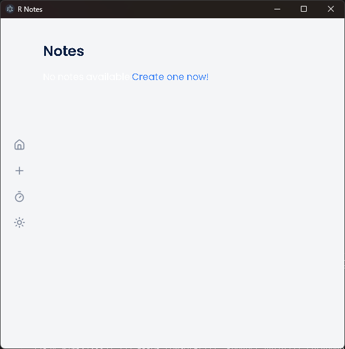

---

# **R-Notes**

*A cross-platform note-taking application built with Electron, React, and TypeScript.*

---

## **Key Features**

* **Cross-Platform Compatibility**: Operates seamlessly on Windows, macOS, and Linux.
* **High Performance**: Developed with TypeScript for type safety and React for responsive UI.
* **Modern Interface**: Clean, intuitive design focused on user experience.
* **Straightforward Setup**: Minimal steps to start development or generate production builds.

---

## **Recommended Development Environment**

* **IDE**: [Visual Studio Code](https://code.visualstudio.com/)
* **Suggested Extensions**:

  * [ESLint](https://marketplace.visualstudio.com/items?itemName=dbaeumer.vscode-eslint) – Enforce consistent coding standards
  * [Prettier](https://marketplace.visualstudio.com/items?itemName=esbenp.prettier-vscode) – Automated code formatting

---

## **Project Setup Instructions**

### Step 1: Install Dependencies

Execute the following to install all required packages:

```bash
npm install
```

### Step 2: Launch Development Environment

Run the development server with live-reloading:

```bash
npm run dev
```

### Step 3: Build for Production

Generate platform-specific optimized builds:

* **Windows**:

  ```bash
  npm run build:win
  ```
* **macOS**:

  ```bash
  npm run build:mac
  ```
* **Linux**:

  ```bash
  npm run build:linux
  ```

---

## **Contributing Guidelines**

We welcome contributions from the community. You may:

* Report bugs and technical issues
* Propose new features
* Submit pull requests with improvements

---

## **License**

Distributed under the terms of the **[MIT License](LICENSE)**.

---

## **Author**

**Rohan Naagar**
Email: [Rohan150907@gmail.com](mailto:Rohan150907@gmail.com)
GitHub: [RohanCyberOps](https://github.com/RohanCyberOps)

---

## **Get Started**

Download, contribute, and elevate your note-taking with **R-Notes**.

---
